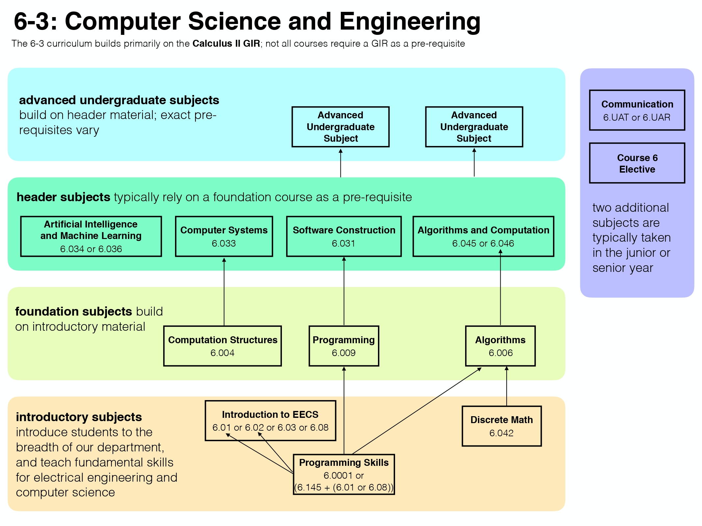

README

### [Info about Degree (6-3)](http://catalog.mit.edu/schools/engineering/electrical-engineering-computer-science/#undergraduatestudytext) 2021

# [Computer Science and Engineering (Course 6-3)](http://catalog.mit.edu/degree-charts/computer-science-engineering-course-6-3/)

## [General Institute Requirements (GIRs)](https://mitadmissions.org/discover/the-mit-education/general-institute-requirements/)

1. [HASS requirement](http://catalog.mit.edu/mit/undergraduate-education/general-institute-requirements/#hassrequirementtext) **Skipped**
1. [Science Core](http://catalog.mit.edu/mit/undergraduate-education/general-institute-requirements/#sciencerequirementtext) **Satisfied**
1. [Physical education requirement](http://catalog.mit.edu/mit/undergraduate-education/general-institute-requirements/#physicaleducationtext) **Satisfied**
1. [Communication Requirement](http://catalog.mit.edu/mit/undergraduate-education/general-institute-requirements/#communicationrequirementtext) **Satisfied**
1. [Laboratory Requirement](http://catalog.mit.edu/mit/undergraduate-education/general-institute-requirements/#laboratoryrequirementtext) **To be satisfied**
1. [REST Requirement](http://catalog.mit.edu/mit/undergraduate-education/general-institute-requirements/#restrequirementtext) **To be satisfied**

## [Departmental Program](http://catalog.mit.edu/degree-charts/computer-science-engineering-course-6-3/)

1. Departmental Requirements
   1. [Introduction to Computer Science and Programming in Python _6.0001_](https://ocw.mit.edu/courses/electrical-engineering-and-computer-science/6-0001-introduction-to-computer-science-and-programming-in-python-fall-2016/)
   1. [Introduction to Computational Thinking and Data Science _6.0002_](https://ocw.mit.edu/courses/electrical-engineering-and-computer-science/6-0002-introduction-to-computational-thinking-and-data-science-fall-2016/)
   1. [Mathmatics for Computer Science _6.042[J]_](https://ocw.mit.edu/courses/electrical-engineering-and-computer-science/6-042j-mathematics-for-computer-science-spring-2015/)
   1. [Introduction to EECS I _6.01SC_](https://ocw.mit.edu/courses/electrical-engineering-and-computer-science/6-01sc-introduction-to-electrical-engineering-and-computer-science-i-spring-2011/)
   1. [Introduction to EECS II: Digital Communication Systems _6.02_](https://ocw.mit.edu/courses/electrical-engineering-and-computer-science/6-02-introduction-to-eecs-ii-digital-communication-systems-fall-2012/)
1. Computer Science Requirements
   1. [Computation Structures _6.004_](https://ocw.mit.edu/courses/electrical-engineering-and-computer-science/6-004-computation-structures-spring-2017/)
   1. [Software Constraction _6.005_](https://ocw.mit.edu/courses/electrical-engineering-and-computer-science/6-005-software-construction-spring-2016/)
      instead of _6.009 & 6.031_
   1. [Introduction to Algorithms _6.006_](https://ocw.mit.edu/courses/electrical-engineering-and-computer-science/6-006-introduction-to-algorithms-spring-2008/)
   1. [Computer System Engineering _6.033_](https://ocw.mit.edu/courses/electrical-engineering-and-computer-science/6-033-computer-system-engineering-spring-2018/)
   1. [Artificial Intelligence _6.034_](https://ocw.mit.edu/courses/electrical-engineering-and-computer-science/6-034-artificial-intelligence-fall-2010/)
   1. [Introduction to Machine Learning _6.036_](https://ocw.mit.edu/courses/electrical-engineering-and-computer-science/6-036-introduction-to-machine-learning-fall-2020/)
   1. [Automata, Computability, and Complexity _6.045[J]_](https://ocw.mit.edu/courses/electrical-engineering-and-computer-science/6-045j-automata-computability-and-complexity-spring-2011/)
   1. [Design and Analysis of Algorithms _6.046[J]_](https://ocw.mit.edu/courses/electrical-engineering-and-computer-science/6-046j-design-and-analysis-of-algorithms-spring-2015/)
1. Elective Subjects
   - Advanced Undergraduate Subjects
     1. [Performance Engineering of Software Systems _6.172_](https://ocw.mit.edu/courses/electrical-engineering-and-computer-science/6-172-performance-engineering-of-software-systems-fall-2018/)
     1. [Database Systems _6.830 / 6.814_](https://ocw.mit.edu/courses/electrical-engineering-and-computer-science/6-830-database-systems-fall-2010/)
   - Independent Inquiry Subjects
     1. [Computer Language Engineering _6.035_](https://ocw.mit.edu/courses/electrical-engineering-and-computer-science/6-035-computer-language-engineering-spring-2010/)

Total Units Beyond the GIRs Required for SB Degree: **0 / 183**

